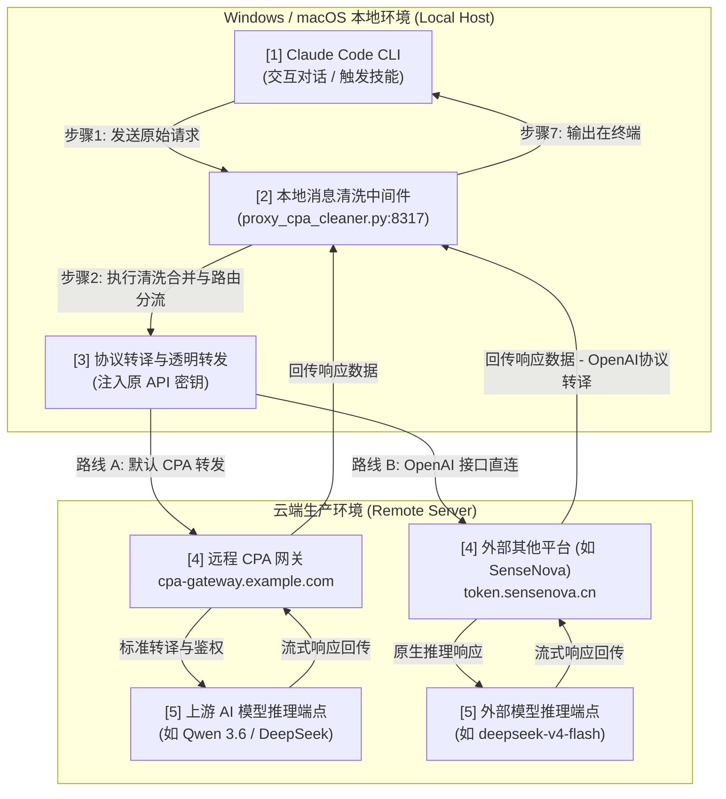

# Claude Code - CPA 多模型驱动与本地消息清洗中间件配置手册

> [!]  **此文档仅适用于 CPA Cleaner 可选组件。cc-menu 核心功能（菜单审计、技能隐藏/显示、预设切换）完全不需要配置本地代理。** 如果您仅使用 cc-menu 管理菜单，无需阅读本文档。

本手册是针对 Windows 和 macOS/Linux 混合操作系统环境下，如何通过 **CPA (CLI Proxy API)** 远程端点（如 `https://your-remote-cpa-endpoint.com`）挂载并驱动 Claude Code 运行，以及如何通过部署 **本地多线程消息清洗与多渠道路由中间件 (CPA Cleaner)**，彻底解决上游模型（如 Qwen/千问 3.6 等）高频返回 `400 System message must be at the beginning` 的接口兼容性问题。

此外，本中间件还内置了**直接对接外部其他云端大模型产品（如商汤 SenseNova、SiliconFlow、DeepSeek 官方等标准 OpenAI 兼容接口）的协议转译与直连路由功能**，无需通过中间商，本地 100% 独立直连！

---

##  第一部分：系统运行机制与流量网络图

在多实例或远程 CPA 混合组网下，流量流经本地中间件对消息流进行前置清洗，确保流量 100% 格式兼容地注入到远程模型中。

### 1.1 流量拓扑结构图



### 1.2 清洗中间件四大核心拦截职责
1. **聚合 System 消息**：自动抽取本地请求体中顶层属性的 `system`（可能为字符串或对象列表），与对话 `messages` 列表中带有 `role: "system"` 的节点合并。
2. **清理中途 System 节点**：将 messages 中间夹杂的所有 system 节点剔除，规避 Qwen/OpenAI 兼容框架中“系统指令必须置于首位且只能有一个”的严格断言。
3. **流式传输兼容**：保留 Stream 头部参数，流式输出远程服务器返回的 event-stream 数据包，保障 Claude Code 在终端打字机响应体验。
4. **多渠道直连路由 (Router)**：智能识别所选模型。若是默认 Qwen 等模型，透明转发至远程 CPA；若选择 `deepseek-v4-flash` 或包含 `sensenova` 的模型，直接直连到商汤 SenseNova 等平台的 OpenAI 兼容端点，绕过中间件直接通信。
5. **协议格式转译 (Translator)**：将本地 Claude Code 发送的 Anthropic (`/v1/messages`) 协议无缝转换为 OpenAI (`/v1/chat/completions`) 协议送给 SenseNova 等平台；同时在接收到 OpenAI 的流式 SSE 或普通响应后，在本地实时重组译回 Anthropic 格式返回给 Claude Code。

---

# 第二部分： 新机/无模型环境下的”冷启动”引导 (Cold Bootstrap Guide)

> **注意：cc-menu 核心功能（审计、隐藏/显示、预设切换）不依赖 CPA Cleaner。** 以下内容仅在使用 CPA Cleaner 代理时参考。

当您在全新的机器上刚刚安装了 Claude Code，或者本地配置文件损坏/过期导致 Claude Code **完全无法启动或没有可用模型** 时，可以通过以下方式完成”冷启动”：

## 一、 方式 A：临时终端环境变量注入 (最快捷、零依赖)

您无需修改任何配置文件，直接通过操作系统控制台的环境变量临时拉起 Claude Code 并直接指向本地清洗代理。

### 1.1 Windows 环境 (PowerShell)
请按顺序在您的 PowerShell 窗口中运行以下命令：
```powershell
# 1. 临时注入本地清洗网关参数
$env:ANTHROPIC_API_KEY=”your-cpa-api-key-here”
$env:ANTHROPIC_BASE_URL=”http://127.0.0.1:8317”
$env:ANTHROPIC_MODEL=”qwen3.6-35b-a3b-nvfp4”

# 2. 启动拉起 Claude Code (它将绕过配置校验成功启动！)
claude
```

### 1.2 macOS / Linux 环境 (Terminal)
请按顺序在您的终端窗口中运行以下命令：
```bash
# 1. 注入临时环境变量
export ANTHROPIC_API_KEY=”your-cpa-api-key-here”
export ANTHROPIC_BASE_URL=”http://127.0.0.1:8317”
export ANTHROPIC_MODEL=”qwen3.6-35b-a3b-nvfp4”

# 2. 启动 Claude Code
claude
```

---

## 二、 方式 B：手工直接改写全局配置文件 (一次性配置)

在未启动 Claude Code 的情况下，直接手动在您的磁盘中创建或改写其全局运行态配置文件，迫使其在初次加载时即原生连接本地清洗网关。

### 2.1 配置文件创建/定位
* **Windows 路径**：`C:\Users\您的用户名\.claude\settings.json`
* **macOS / Linux 路径**：`~/.claude/settings.json`

### 2.2 覆盖写入以下 JSON 结构
如果文件不存在，请手动新建该文件；如果已存在，请将以下 `env` 变量块完整覆盖写入：
```json
{
  “env”: {
    “ANTHROPIC_API_KEY”: “your-cpa-api-key-here”,
    “ANTHROPIC_BASE_URL”: “http://127.0.0.1:8317”,
    “ANTHROPIC_MODEL”: “qwen3.6-35b-a3b-nvfp4”,
    “ANTHROPIC_DEFAULT_SONNET_MODEL”: “qwen3.6-35b-a3b-nvfp4”,
    “ANTHROPIC_DEFAULT_SONNET_MODEL_NAME”: “qwen3.6-35b-a3b-nvfp4”,
    “ANTHROPIC_DEFAULT_HAIKU_MODEL”: “qwen3.6-35b-a3b-nvfp4”,
    “ANTHROPIC_DEFAULT_HAIKU_MODEL_NAME”: “qwen3.6-35b-a3b-nvfp4”
  },
  “skipModelValidation”: true
}
```
*(注：设置 `”skipModelValidation”: true` 能让 Claude CLI 绕过对原厂 Anthropic 模型名称的格式强断言，完美加载第三方 CPA 兼容模型。)*

配置完成后，打开任意终端直接输入 `claude`，程序即可瞬间秒级启动！

---

## 📌 第三部分：关于 cc-switch 安装必要性的重要说明

**核心结论：在当前集成架构下，安装 `cc-switch` 是【完全可选的（非必须）】。**

### 3.1 为什么不再必须安装 `cc-switch`？
由于我们已经成功将 CPA 消息清洗网关与 `cc-menu` 进行深度整合，`cc-menu` 的内置命令已经能够完全覆盖原本由 `cc-switch` 承担的核心职责：
* **零依赖模型切换**：在 Claude Code 聊天框中输入 `/switch <model_name>` 快捷命令时，`cc-menu` 会直接编辑 `~/.claude/settings.json` 的模型环境变量，实现零依赖的动态模型切换。
* **无感默认清洗**：Claude 本地的 API 入口（`ANTHROPIC_BASE_URL`）指向本地清洗网关 `http://127.0.0.1:8317` 后，所有交互流量都将无感地通过本地多线程中间件清洗后，安全送达云端。

因此，**您仅需要拷贝本 `cc-menu` 文件夹，即可独立完成 100% 完备的 CPA 驱动运行！**

### 3.2 什么时候推荐继续使用/安装 `cc-switch`？
如果您有以下扩展需求，推荐继续保留或安装 `cc-switch`：
* **多渠道商图形化管理**：当您除了 CPA 服务之外，还需要在本地高频切换到其他独立的 API 渠道商（如 OpenRouter、Ollama 本地模型、DeepSeek 官方直连、Anthropic 官方原厂等）时，`cc-switch` 作为一键切换面板，能够极大地提升管理效率。
* **多端一致性映射**：如果您原先的开发习惯重度依赖 `cc-switch` 的客户端流程，保留它可以让您的配置无感地桥接到本项目的消息清洗网关。

---

# 第四部分：本地多线程清洗网关 (CPA Cleaner) 部署步骤

> **[!]  以下内容是可选组件的部署说明。cc-menu 核心功能（审计、隐藏/显示技能、预设切换、自定义命令）完全独立运行，无需部署本中间件。**

为了彻底消除 Qwen 等模型对 system 消息的严格限制，在本地运行一个轻量级、多线程的网关代理服务。

## 一、 中间件源码部署 (`proxy_cpa_cleaner.py`)

在本地新建并保存以下 Python 转发与清洗代理脚本：
📄 **文件路径**：`~/.claude/skills/cc-menu/bin/proxy_cpa_cleaner.py`

```python
# (此处为 proxy_cpa_cleaner.py 最新多渠道路由直连与协议转译版，详见源码文件)
```
*(注：本地 `proxy_cpa_cleaner.py` 已实现了 OpenAI completions 流式到 Anthropic event-stream 的本地实时自建翻译，实现零依赖连通外部其他任意 OpenAI 大模型产品。)*

---

## 二、 环境变量管理与安全防护 (`.env`)

为了保证敏感信息的安全性，项目在根目录下独立管理配置变量，且该文件已被加入 `.gitignore`，绝对不会泄露至 GitHub。

### 2.1 配置文件样本 (`.env.example`)
📄 **文件路径**：`~/.claude/skills/cc-menu/.env.example`
```env
# CPA Cleaner Configuration (Rename this file to .env and fill in your values)
CPA_PORT=8317
CPA_TARGET_URL=https://your-remote-cpa-endpoint.com
CPA_API_KEY=your-cpa-api-key-here

# SenseNova Direct API Route Configuration (Direct connection)
SENSENOVA_TARGET_URL=https://token.sensenova.cn
SENSENOVA_API_KEY=your-sensenova-api-key-here
```

### 2.2 本地私有配置文件 (`.env`)
📄 **文件路径**：`~/.claude/skills/cc-menu/.env`
```env
CPA_PORT=8317
CPA_TARGET_URL=https://your-remote-cpa-endpoint.com
CPA_API_KEY=your-cpa-api-key-here

SENSENOVA_TARGET_URL=https://token.sensenova.cn
SENSENOVA_API_KEY=your-sensenova-api-key-here
```
---

## 三、 首次运行与手动启动 (Cold Boot & Initial Startup)

当首次完成以上部署和配置（如 `.env` 配置文件）时，代理中间件默认处于未启动状态。请使用以下方法完成启动：

### 3.1 方式 A：使用 cc-menu 命令行管家启动（推荐）
项目内置了极简的 `cc-menu` 管理管家脚本，支持快速一键管理中间件状态：
- **Windows (PowerShell)**:
  ```powershell
  # 启动本地多线程消息清洗中间件 (默认监听 8317 端口)
  C:\Users\admin\.claude\skills\cc-menu\bin\cc-menu.ps1 cleaner start
  
  # 查看中间件的实时运行状态 (确认是否已在 8317 端口就绪)
  C:\Users\admin\.claude\skills\cc-menu\bin\cc-menu.ps1 cleaner status
  ```
- **macOS / Linux**:
  ```bash
  # 启动中间件
  ~/.claude/skills/cc-menu/bin/cc-menu.sh cleaner start
  
  # 查看运行状态
  ~/.claude/skills/cc-menu/bin/cc-menu.sh cleaner status
  ```

### 3.2 方式 B：底层命令行手动直接启动 (开发调试)
如果您想在前台实时查看清洗与协议转译的交互调试日志，可以直接使用 `python` 解释器启动服务：
- **Windows**:
  ```cmd
  python "C:\Users\admin\.claude\skills\cc-menu\bin\proxy_cpa_cleaner.py"
  ```
- **macOS / Linux**:
  ```bash
  python3 ~/.claude/skills/cc-menu/bin/proxy_cpa_cleaner.py
  ```
启动成功后，控制台会输出服务监听信息，确认 `[OK] CPA Cleaner started successfully on http://127.0.0.1:8317` 即表示启动成功。此时可开启新的终端窗口，运行 `claude` 聊天工具！

---

## 四、 开机常驻自启动配置 (守护进程)

为了不需要在每次打开电脑时都在终端手动启动中间件网关，您可以配置操作系统的自启动服务。

### 3.1 Windows 本地静默自启动 (快捷方式法)
1. 按下快捷键 `Win + R` 输入 `shell:startup`，回车打开 Windows 开机启动文件夹。
2. 在该文件夹中新建一个文本文件，重命名为 `start-cpa-cleaner.bat`。
3. 写入以下内容（脚本将静默后台拉起中间件）：
```bat
@echo off
set PYTHONIOENCODING=utf-8
start /b pythonw "C:\Users\admin\.claude\skills\cc-menu\bin\proxy_cpa_cleaner.py"
```
*(注：使用 `pythonw` 启动 Python 脚本可以彻底隐藏控制台黑框，默默在后台常驻运行)*

### 3.2 macOS 本地开机自启动 (LaunchAgent守护)
Mac 用户可以通过编写 `LaunchAgent` plist 配置文件达成开机后台自动运行并实现故障崩溃自动拉起。

1. 在 Mac 终端运行：
```bash
nano ~/Library/LaunchAgents/com.cpa.cleaner.plist
```
2. 粘贴并保存以下 XML 配置：
```xml
<?xml version="1.0" encoding="UTF-8"?>
<!DOCTYPE plist PUBLIC "-//Apple//DTD PLIST 1.0//EN" "http://www.apple.com/DTDs/PropertyList-1.0.dtd">
<plist version="1.0">
<dict>
    <key>Label</key>
    <string>com.cpa.cleaner</string>
    <key>ProgramArguments</key>
    <array>
        <string>/usr/bin/python3</string>
        <string>/Users/您的用户名/.claude/skills/cc-menu/bin/proxy_cpa_cleaner.py</string>
    </array>
    <key>RunAtLoad</key>
    <true/>
    <key>KeepAlive</key>
    <true/>
    <key>StandardOutPath</key>
    <string>/Users/您的用户名/.claude/cleaner.log</string>
    <key>StandardErrorPath</key>
    <string>/Users/您的用户名/.claude/cleaner.err</string>
</dict>
</plist>
```
3. 载入并即刻启动服务：
```bash
launchctl load ~/Library/LaunchAgents/com.cpa.cleaner.plist
launchctl start com.cpa.cleaner
```

---

# 第五部分：SQLite 数据库转接与配置文件绑定

如果您先前已经在使用 `cc-switch` 并且希望保持 `cc-switch` 的客户端流程，请运行以下修复流程，将它的底座 SQLite 数据库的请求地址重定向至本地清洗网关。

## 一、 运行一键配置修复脚本 (以 Windows 路径为例)

在本地执行配置修复脚本，它会自动连接 `cc-switch.db` 并同步改写 Claude 全局配置。
📄 **脚本路径**：`C:\Users\admin\AppData\Local\Temp\opencode\fix_to_local_cleaner.py`

*(具体 python 脚本实现参见之前章节，运行即可完成 SQLite 自动重定向。)*

---

# 第六部分：Claude Code 内部快捷斜杠指令集

为了防止 Claude Code CLI 原生的 Markdown 解析器渲染报错，内部所有的斜杠指令均去除了标准的 Markdown 列表标记（如 `* `, `1. ` 等），替换为安全文本段落结构。

## 一、 查询模型列表指令 (`/models`)
📄 **配置文件路径**：`~/.claude/commands/models.md`

```markdown
---
description: 查看当前 CPA 平台支持的所有可用模型列表及切换指令
---

您是一个专业的平台信息展示助手。请读取并为用户展示当前平台支持的可用模型列表：

###  CPA 平台可用模型列表

###  Qwen (通义千问系列)
[1] Qwen3.6-35b-a3b-nvfp4 -> 当前默认模型，推理与编码核心担当。

###  快捷切换指令

» 输入 /models 随时呼出本速查表。
» 输入 /switch <模型标识> (例如：/switch gpt-5.5) 实现一键切换大模型！
```

---

## 二、 动态模型切换指令 (`/switch`)
📄 **配置文件路径**：`~/.claude/commands/switch.md`

```markdown
---
description: 动态切换当前会话所使用的 AI 模型 (配合本地清洗中间件)
argument-hint: <model_name>
---

您已被授权作为系统配置修改专家。当用户运行此命令并提供 `<model_name>` 参数时，请您严格按照以下步骤操作，为用户执行模型一键切换：

步骤 1：读取配置文件 — 读取并分析 `~/.claude/settings.json` 文件。
步骤 2：修改模型字段 — 将 `env.ANTHROPIC_MODEL` 的值修改为用户输入的 `<model_name>`。为了保证全局协议和通道的一致性，请同步将 `env.ANTHROPIC_DEFAULT_HAIKU_MODEL`、`env.ANTHROPIC_DEFAULT_HAIKU_MODEL_NAME`、`env.ANTHROPIC_DEFAULT_SONNET_MODEL`、`env.ANTHROPIC_DEFAULT_SONNET_MODEL_NAME`、`env.ANTHROPIC_DEFAULT_OPUS_MODEL`、`env.ANTHROPIC_DEFAULT_OPUS_MODEL_NAME` 均修改为指定的 `<model_name>`。
步骤 3：写入并保存 — 将修改后的 JSON 配置数据完整写回原路径保存。
步骤 4：用户反馈提示 — 向用户确认已经成功切换到新的模型 `<model_name>`。同时友好且显著地提醒用户：由于当前会话上下文已被模型预加载，建议在输入框中运行 `/reset` 重新加载会话以强制生效新模型。
```

---

# 第七部分：多模型动态探测与自动注册服务 (Auto-Tester)

本项目不仅提供了被动清洗能力，还通过 `test_and_register_models.py` 具备了主动测试模型可用性、排除不可用模型并一键动态重新登记到系统的卓越能力。

*(具体 python 脚本实现参见之前章节，执行即可完成全自动模型连通探测与一键注册。)*

---

# 第八部分：日常运维、故障查杀与防范指南

## 一、 端口占用冲突查杀 (WinError 10048)

当您在 Windows 上遇到错误：
`OSError: [WinError 10048] 通常每个套接字地址(协议/网络地址/端口)只允许使用一次。`
说明原有的网关程序尚未释放，或被其他第三方工具强占了 `8317` 端口。

**解决方案：**
1. **自动终止**：在命令行中运行以下命令停止代理，它会自动定位 8317 对应的 PID 并强行结束进程：
   ```bash
   cc-menu.ps1 cleaner stop
   ```
2. **手工排查（PowerShell）**：
   ```powershell
   # 1. 查找哪个进程占用了 8317
   Get-NetTCPConnection -LocalPort 8317 -ErrorAction SilentlyContinue
   
   # 2. 如果存在，比如进程 PID 为 11468，执行强行结束
   Stop-Process -Id 11468 -Force
   ```

## 二、 编码报错故障处理 (UnicodeEncodeError)

在 Windows 控制台（CMD/PowerShell）下，若 Python 清洗中间件在控制台打印中文时抛出类似以下的错误：
`UnicodeEncodeError: 'gbk' codec can't encode character '\U0001f7e2'`
这是因为 Windows 控制台的默认字符集不是 UTF-8，而是一些局域性非 UTF-8 字符集（如 GBK）。

**解决方案：**
1. 项目中的 `cc-menu.sh`、`proxy_cpa_cleaner.py` 等脚本已经全部重构，去除了所有复杂高级 Emoji，并统一采用 `[RUNNING]`, `[OK]`, `[WARN]` 等全兼容字符前缀。
2. 运行 wrapper 脚本 `cc-menu.bat` 或 `cc-menu.ps1` 时，它们在调用主逻辑前会自动设置环境变量 `PYTHONIOENCODING=utf-8`，强行将 Python 重定向至标准的 UTF-8 流管道，完美解决编解码崩溃问题。

## 三、 模型切换生效的缓存防范 (/reset)

**现象**：已经在聊天框执行了 `/switch gpt-5.5`，并且修改了 `.claude/settings.json`，但发现 Claude 依然用以前的老模型作答。
**原理解析**：Claude Code CLI 程序为了极速响应，会在同一个进程会话内预加载并强力缓存当前会话的 Metadata 环境参数。
**唯一防范对策**：在聊天输入框内输入 `/reset`，回车强制重置、清空当前会话上下文并进行环境变量重新拉取。新切换的模型就会立刻 100% 被刷新挂载！
